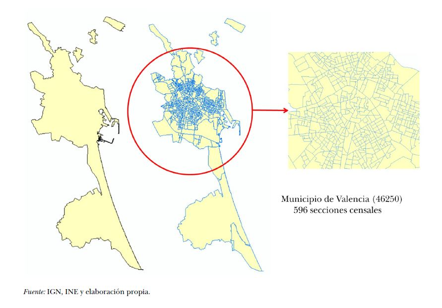
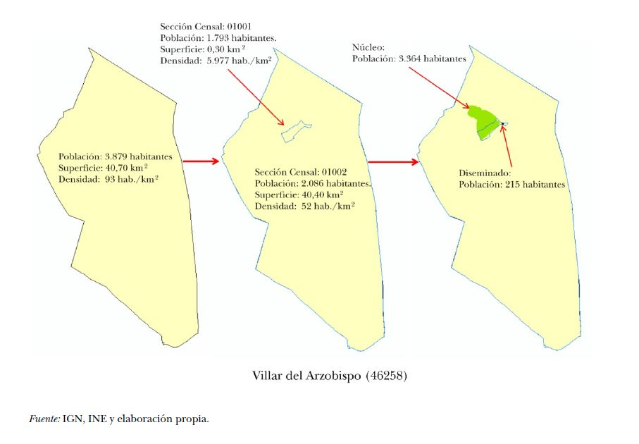
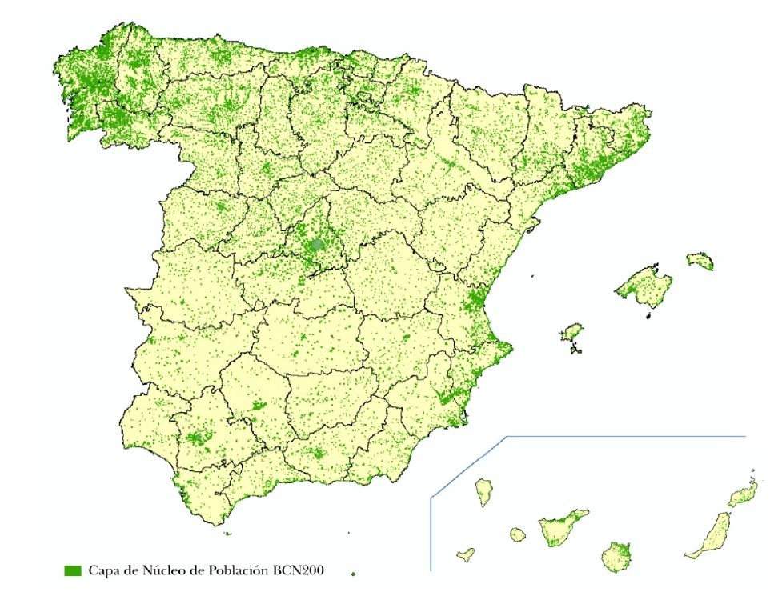
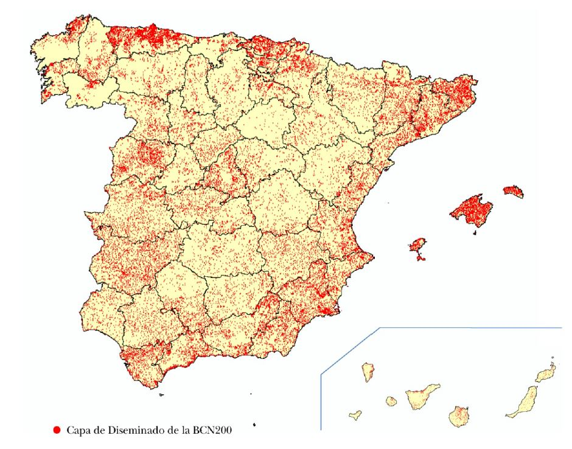
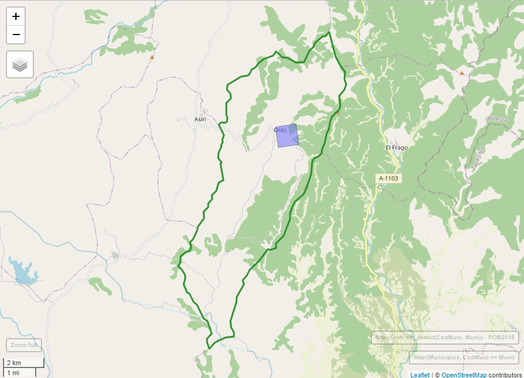
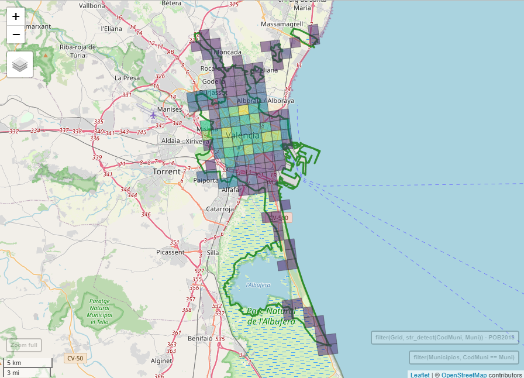
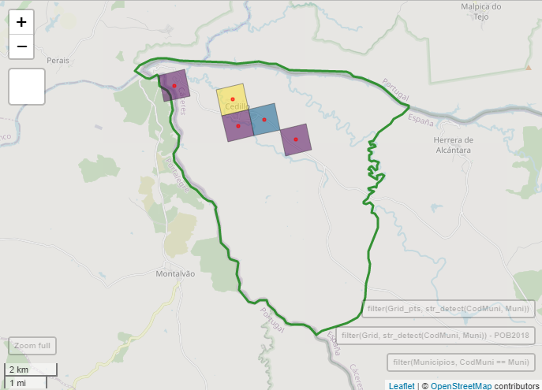

```{r setup, include = FALSE}
options(htmltools.dir.version = FALSE)
knitr::opts_chunk$set(message = FALSE, warning = FALSE, fig.align = "center")
xaringanExtra::use_tachyons()
xaringanExtra::use_tile_view()
xaringanExtra::use_panelset()
```

```{r library, include = FALSE}
library(tidyverse)
library(here)
```

# Prerequisitos... [¡estos!](https://go.uv.es/goerlich/Routing)

```{r, echo = FALSE, eval = TRUE, fig.asp = 2/2, out.width = "100%", fig.align = "center"}

```

Cualquier ejercicio de accesibilidad (geográfica) tiene (al menos) 3 patas:

1. un **origen** por parte de quien accede,

2. una **ruta**, por algún medio de trasporte determinado, y

3. un **destino** al centro donde se accede.

--

Ya vimos como geocodificar destinos y calcular rutas para un **origen dado**. Le damos ahora una vuelta de tuerca al **origen**.
¡La distribución de la población!

Mantenemos el resto del marco de análisis de la [monografía de accesibilidad](https://www.ivie.es/es_ES/ptproyecto/distribucion-la-poblacion-acceso-los-servicios-publicos/)
con 1 sola alteración no trivial: ¡los **origenes**!

---

# ¿Es conveniente alterar los orígenes? **Si**

La **escala de análisis** de la [monografía de accesibilidad](https://www.ivie.es/es_ES/ptproyecto/distribucion-la-poblacion-acceso-los-servicios-publicos/) era
**municipal**: [_"...el municipio es un punto, la coordenada de la capital. Implícitamente suponemos que la población está concentrada en ese punto._"](https://fgoerlich.github.io/Routing/#20)

Esta era la **principal limitación del trabajo**. La población &ndash;el orígen de donde partían nuestros cálculos de rutas&ndash; estaba localizada en un punto del municipio,
de forma que teníamos 8 131 puntos de población, tantos como municipios. 

En cierta forma era si como nuestros destinos no hubieran estado georeferenciados, y solo dispusiérmos de la información del número de oficinas que existen en cada municipio,
y estas las localizáramos en el mismo punto que la población.

**La georeferenciación de las oficinas ciertamente afina los cálculos, ¡`r emo::ji("+1")`!, pero no lo suficiente.**

--

¿Disponemos de población georeferenciada? **No**

--

Bueno, el [INE](https://www.ine.es/) **si** a partir del Censo 2021, ¡pero esta información nunca será publica!

---

# ¿Alternativas por debajo del municipio?

**Secciones Censales**: Poco útiles fuera del mundo urbano &ndash;el 70% de los municipios tiene una sola sección censal&ndash;.

```{r, echo = FALSE, eval = TRUE, fig.asp = 2/2, out.width = "80%", fig.align = "center"}

```

---

# ¿Alternativas por debajo del municipio?

**Secciones Censales**: Su exahustiva cobertura del término municipal hace que haya siempre al menos una sección censal residual.

```{r, echo = FALSE, eval = TRUE, fig.asp = 2/2, out.width = "80%", fig.align = "center"}

```

---

# ¿Alternativas por debajo del municipio?

**Nomenclátor**: ¿Tenemos coordenadas de los Núcleos de Población? **Si**. 

```{r, echo = FALSE, eval = TRUE, fig.asp = 2/2, out.width = "75%", fig.align = "center"}

```

---

# ¿Alternativas por debajo del municipio?

**Nomenclátor**: ¡Incluso del diseminado! ¡Sorprendente! 

```{r, echo = FALSE, eval = TRUE, fig.asp = 2/2, out.width = "75%", fig.align = "center"}

```

???

¡Son la de su _Entidad Singular_!
En definitiva, que caráctar administrativo del Nomenclátor, junto con el hecho de que son los ayuntamientos los responsables de su gestión,
con prácticamente nula armonización, hace difícil su utilización en este contexto.
Por ejemplo, si miramos a Madrid veremos que solo tiene una Entidad Singular, un núcleo y ningún diseminado, lo que contrasta con municipios pequeños
y medianos de de Galicia o Asturias que tienen cientos de pequeños núcleos y diseminados.

---

# ¿Alternativas por debajo del municipio?

**Grid de población**: ¿Tenemos población en formato _grid_? A veces...

¡Están en el [GISCO](https://ec.europa.eu/eurostat/web/gisco) de Eurostat!

--

¿Que es una _grid_ de población? Una cifra de población por celda, ¡independiente de los lindes administrativos!

--

.pull-left[

```{r, echo = FALSE, eval = TRUE, fig.asp = 2/2, out.width = "100%", fig.align = "center"}

```

]

--

.pull-right[

```{r, echo = FALSE, eval = TRUE, fig.asp = 2/2, out.width = "100%", fig.align = "center"}

```

]

---

# ¡Probemos!

Si la población del municipio estaba concentrada en un punto, ¿donde está la población de la celda a efectos del cálculo de rutas?

--

.pull-left[

```{r, echo = FALSE, eval = TRUE, fig.asp = 2/2, out.width = "120%", fig.align = "center"}

```

]

.pull-right[

<br><br><br><br>

¡En el centro de la celda!

]

<br>

Tendremos una ruta para cada celda, cuyo centro constituye nuestro origen.

_Bussines as usual!_

---

class: inverse, center, middle

# _Get Started_

---

# Problema real

Disponemos del fichero de Oficinas bancarias de diciembre de 2020 del Banco de España georeferenciado. **Destinos**

Disponemos de una [_grid_ de población para 2018](https://ec.europa.eu/eurostat/web/gisco/geodata/reference-data/population-distribution-demography/geostat). **Origenes**

Disponemos de la [tecnología para el cálculo de **rutas**](https://go.uv.es/goerlich/Routing): distancias y tiempos sobre la red de carreteras.

Y queremos estimar la **distancia** y el **tiempo** de acceso de **cada municipio** &ndash;o cualquier otra unidad administrativa&ndash; a la **oficina más cercana**.

.bg-washed-green.b--dark-green.ba.bw2.br3.shadow-5.ph4.mt4[

Se trata exactamente del **mismo problema** que resolvimos en la [presentación anterior](https://go.uv.es/goerlich/Routing) con la única diferencia que
ahora disponemos de la población en _grid_ en lugar de la población por municipio.

Esta generalización permitirá contestar preguntas más interesantes que el de la oficina más cercana.

]

---

# Problema real: _Houston, we have a problem_ 

¿Cual es la dimensión de nuestro problema?

**Origenes:** 74 914 celdas.

**Destinos:** 22 558 oficinas.

--

La matriz de **O**rigen-**D**estino (OD) tiene 1 689 910 012 celdas.

¡Debemos calcular más de 1 600 millones de rutas y elegir la óptima para cada celda! ¡Y luego agregarlas a municipios! ¡`r emo::ji("poop")`!

--

Claramente debemos reducir la dimensión de nuestro problema. ¡Ya era necesario reducirlo con los 8 131 municipios!

Debe resultar obvio que **no** podemos resolver este problema con un servidor de rutas remoto: [Cartociudad](https://www.cartociudad.es/portal/),
[Google](https://mapsplatform.google.com/) o [Open Street Maps (OSM)](https://www.openstreetmap.org/#map=6/40.007/-2.488), como hicimos antes.


Ya sea por tiempo de cómputo o por coste.

---

# Problema real: _We found a solution_ ¡`r emo::ji("smile")`!

Afortunadamente es posible instalar en local un servidor de rutas basado en [OSM](http://project-osrm.org/) accesible mediante una
librería de [_R_](https://cran.r-project.org/), [osrm](https://cran.r-project.org/web/packages/osrm/osrm.pdf), o atacando directamente
la [API](http://project-osrm.org/docs/v5.24.0/api/#).

¡Héctor lo ha instalado de forma exitosa, `r emo::ji("+1")`!

¡Y funciona _smooth as a baby´s bottom_!

El rendimiento del servidor es de unos 4.5 millones de rutas día.

En la práctica ello significa las funciones que ya teníamos nos sirven para cálculos intensivos abandonando [Cartociudad](https://www.cartociudad.es/portal/) y
[Google](https://mapsplatform.google.com/), y utilizando solo [OSM](https://www.openstreetmap.org/#map=6/40.007/-2.488).

¡Además hacemos los cálculos en casa!

.footnote[(*) El rendimiento de Cartociudad es de unas 300 000 rutas día y, probablemente, dismininuye con el número de rutas.]

---

background-image: url(https://www.ivie.es/wp-content/uploads/2017/02/logo.jpg), url(https://www.uv.es/recursos/fatwirepub/css/logoPeu.png)
background-position: 95% 5%, 5% 95%
background-size: 12%, 20%

class: center, middle

# ¡Gracias por la atención!

## .green[¿Preguntas?]

???

Slides created via the R package [**xaringan**](https://github.com/yihui/xaringan).

