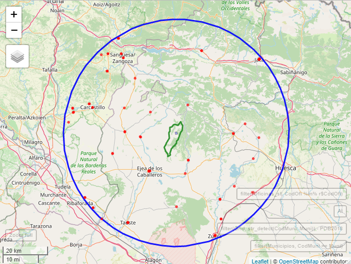
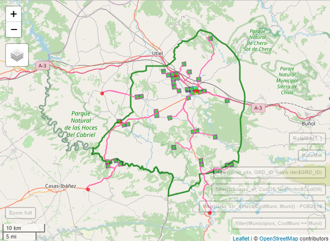

```{r setup, include = FALSE}
options(htmltools.dir.version = FALSE)
knitr::opts_chunk$set(message = FALSE, warning = FALSE, fig.align = "center")
xaringanExtra::use_tachyons()
xaringanExtra::use_tile_view()
xaringanExtra::use_panelset()
```

```{r library, include = FALSE}
library(tidyverse)
library(here)
```

# Prerequisitos... [¡estos!](https://go.uv.es/goerlich/Routing)

```{r, echo = FALSE, eval = TRUE, fig.asp = 2/2, out.width = "100%", fig.align = "center"}
knitr::include_graphics("./img/01_MonoFRA.jpg")
```

Cualquier ejercicio de accesibilidad (geográfica) tiene (al menos) 3 patas:

1. un **origen** por parte de quien accede,

2. una **ruta**, por algún medio de trasporte determinado, y

3. un **destino** al centro donde se accede.

--

Ya vimos como geocodificar destinos y calcular rutas para un **origen dado**. Le damos ahora una vuelta de tuerca al **origen**.
¡La distribución de la población!

Mantenemos el resto del marco de análisis de la [monografía de accesibilidad](https://www.ivie.es/es_ES/ptproyecto/distribucion-la-poblacion-acceso-los-servicios-publicos/)
con 1 sola alteración no trivial: ¡los **origenes**!

---

# ¿Es conveniente alterar los orígenes? **Si**

La **escala de análisis** de la [monografía de accesibilidad](https://www.ivie.es/es_ES/ptproyecto/distribucion-la-poblacion-acceso-los-servicios-publicos/) era
**municipal**: [_"...el municipio es un punto, la coordenada de la capital. Implícitamente suponemos que la población está concentrada en ese punto._"](https://fgoerlich.github.io/Routing/#20)

Esta era la **principal limitación del trabajo**. La población &ndash;el orígen de donde partían nuestros cálculos de rutas&ndash; estaba localizada en un punto del municipio,
de forma que teníamos 8 131 puntos de población, tantos como municipios. 

En cierta forma, era si como nuestros destinos no hubieran estado georeferenciados, solo dispusiérmos de la información del número de oficinas que existen en cada municipio,
y estas las localizáramos en el mismo punto que la población.

**La georeferenciación de las oficinas ciertamente afina los cálculos, ¡`r emo::ji("+1")`!, pero no lo suficiente.**

--

¿Disponemos de población georeferenciada? **No**

--

Bueno, el [INE](https://www.ine.es/) **si** a partir del Censo 2021, ¡pero esta información nunca será pública!

---

# ¿Alternativas por debajo del municipio?

**Secciones Censales**: Poco útiles fuera del mundo urbano &ndash;el 70% de los municipios tiene una sola sección censal&ndash;.

```{r, echo = FALSE, eval = TRUE, fig.asp = 2/2, out.width = "80%", fig.align = "center"}
knitr::include_graphics("./img/02_SSCC46250.jpg")
```

---

# ¿Alternativas por debajo del municipio?

**Secciones Censales**: Su exahustiva cobertura del término municipal hace que haya siempre al menos una sección censal residual.

```{r, echo = FALSE, eval = TRUE, fig.asp = 2/2, out.width = "80%", fig.align = "center"}
knitr::include_graphics("./img/03_SSCC46258.jpg")
```

---

# ¿Alternativas por debajo del municipio?

**Nomenclátor**: ¿Tenemos coordenadas de los Núcleos de Población? **Si**. 

```{r, echo = FALSE, eval = TRUE, fig.asp = 2/2, out.width = "75%", fig.align = "center"}
knitr::include_graphics("./img/04_Nucleos.jpg")
```

---

# ¿Alternativas por debajo del municipio?

**Nomenclátor**: ¡Incluso del diseminado! ¡Sorprendente! 

```{r, echo = FALSE, eval = TRUE, fig.asp = 2/2, out.width = "75%", fig.align = "center"}
knitr::include_graphics("./img/05_Diseminados.jpg")
```

???

¡Son la de su _Entidad Singular_!
En definitiva, que caráctar administrativo del Nomenclátor, junto con el hecho de que son los ayuntamientos los responsables de su gestión,
con prácticamente nula armonización, hace difícil su utilización en este contexto.
Por ejemplo, si miramos a Madrid veremos que solo tiene una Entidad Singular, un núcleo y ningún diseminado, lo que contrasta con municipios pequeños
y medianos de de Galicia o Asturias que tienen cientos de pequeños núcleos y diseminados.

---

# ¿Alternativas por debajo del municipio?

**Grid de población**: ¿Tenemos población en formato _grid_? A veces...

¡Están en el [GISCO](https://ec.europa.eu/eurostat/web/gisco) de Eurostat!

--

¿Que es una _grid_ de población? Una cifra de población por celda, ¡independiente de los lindes administrativos!

--

.pull-left[

```{r, echo = FALSE, eval = TRUE, fig.asp = 2/2, out.width = "100%", fig.align = "center"}
knitr::include_graphics("./img/06_Grid50197.png")
```

]

--

.pull-right[

```{r, echo = FALSE, eval = TRUE, fig.asp = 2/2, out.width = "100%", fig.align = "center"}
knitr::include_graphics("./img/07_Grid46250.png")
```

]

---

# ¡Probemos!

Si la población del municipio estaba concentrada en un punto, ¿donde está la población de la celda a efectos del cálculo de rutas?

--

.pull-left[

```{r, echo = FALSE, eval = TRUE, fig.asp = 2/2, out.width = "120%", fig.align = "center"}

```

]

.pull-right[

<br><br><br><br>

¡En el centro de la celda!

]

<br>

Tendremos una ruta para cada celda, cuyo centro constituye nuestro origen.

_Bussines as usual!_

---

class: inverse, center, middle

# _Get Started_

---

# Problema real

Disponemos del fichero de Oficinas bancarias de diciembre de 2020 del Banco de España georeferenciado. **Destinos**

Disponemos de una [_grid_ de población para 2018](https://ec.europa.eu/eurostat/web/gisco/geodata/reference-data/population-distribution-demography/geostat). **Origenes**

Disponemos de la [tecnología para el cálculo de **rutas**](https://go.uv.es/goerlich/Routing): distancias y tiempos sobre la red de carreteras.

Y queremos estimar la **distancia** y el **tiempo** de acceso de **cada municipio** &ndash;o cualquier otra unidad administrativa&ndash; a la **oficina más cercana**.

.bg-washed-green.b--dark-green.ba.bw2.br3.shadow-5.ph4.mt4[

Se trata exactamente del **mismo problema** que resolvimos en la [presentación anterior](https://go.uv.es/goerlich/Routing) con la única diferencia que
ahora disponemos de la población en _grid_ en lugar de la población por municipio.

Esta generalización permitirá contestar preguntas más interesantes que el de la oficina más cercana.

]

---

# Problema real: _Houston, we have a problem_ 

¿Cual es la dimensión de nuestro problema?

**Origenes:** 74 914 celdas.

**Destinos:** 22 558 oficinas.

--

La matriz de **O**rigen-**D**estino (OD) tiene 1 689 910 012 celdas.

¡Debemos calcular más de 1 600 millones de rutas y elegir la óptima para cada celda! ¡Y luego agregarlas a municipios! ¡`r emo::ji("poop")`!

--

Claramente debemos reducir la dimensión de nuestro problema. ¡Ya era necesario reducirlo con los 8 131 municipios!

Debe resultar obvio que **no** podemos resolver este problema con un servidor de rutas remoto: [Cartociudad](https://www.cartociudad.es/portal/),
[Google](https://mapsplatform.google.com/) o [Open Street Maps (OSM)](https://www.openstreetmap.org/#map=6/40.007/-2.488), como hicimos antes.


Tanto por tiempo de cómputo o como por coste en algunos casos.

---

# Problema real: _We found a solution_ ¡`r emo::ji("smile")`!

Afortunadamente es posible instalar en local un servidor de rutas basado en [OSM](http://project-osrm.org/) accesible mediante una
librería de [_R_](https://cran.r-project.org/), [osrm](https://cran.r-project.org/web/packages/osrm/osrm.pdf), o atacando directamente
la [API](http://project-osrm.org/docs/v5.24.0/api/#).

¡Héctor lo ha instalado de forma exitosa, `r emo::ji("+1")`!

¡Y funciona _smooth as a baby´s bottom_!

El rendimiento del servidor es de unos 4.5 millones de rutas día.

En la práctica ello significa las funciones que ya teníamos nos sirven para cálculos intensivos abandonando [Cartociudad](https://www.cartociudad.es/portal/) y
[Google](https://mapsplatform.google.com/), y utilizando solo [OSM](https://www.openstreetmap.org/#map=6/40.007/-2.488).

¡Además hacemos los cálculos en casa!

.footnote[(*) El rendimiento de Cartociudad es de unas 300 000 rutas día y, probablemente, dismininuye con el número de rutas.]

---

# _Routing_ OSM: Funciones

```{r, eval = FALSE}
# Distancia y Tiempo de Viaje entre 2 puntos (coordenadas)
osm_get_distance <- function (from, to, profile = c("car", "bike", "foot"), server = NULL)

# Distancia y Tiempo de Viaje entre 2 vectores de coordenadas
oms_distance <- function(from, to, profile = c("car", "bike", "foot"), server = NULL)
```

- `osm_get_distance()`: ruta única entre 2 puntos (coordenadas) en WGS84.

- `oms_distance()`: rutas masivas _pairwise_ entre 2 vectores de puntos (coordenadas), o entre un origen y múltiples destinos o entre múltiples orígenes y un destino en WGS84.

Calcula rutas en **coche**, a **pie** o en **bicicleta**.

La opción `server` permite acceder a un servidor local.

En ambos casos devuelve un `tibble` con la distancia (en metros), el tiempo de viaje (en segundos) y una variable de _status_: `OK`, `NULL_VALUES` o `code server`.

---

# _Routing_ OSM: Funciones - _tecnicality_

```{r, eval = FALSE}
# snap de coordenadas a la street network
osm_nearest <- function(longitud, latitud, profile = c("car", "bike", "foot"), server = NULL)
```

- `osm_nearest()`: dadas unas coordenadas cualquiera (en WGS84) devuelve las coordenadas (en WGS84) del nodo de la red más cercano y su distancia.

La opción `server` permite acceder a un servidor local.

Devuelve un `tibble` con las coordenadas del nodo, longitud y latitud (en WGS84), la distancia (en metros) al nodo de la red más cercano y una variable de _status_: `OK`, o `code server`.

---

# _Routing_ OSM: Funciones para pintar las rutas

```{r, eval = FALSE}
# OSM: Ruta entre 2 puntos (coordenadas)
osm_get_route <- function(from, to, profile = c("car", "bike", "foot"), overview = c("full", "simplified"), server = NULL, plot = FALSE)
# OSM: Rutas entre 2 vectores de coordenadas
osm_routing <- function(from, to, profile = c("car", "bike", "foot"), progress = TRUE, overview = c("full", "simplified"), server = NULL, ...)
```

Si queremos pintar las rutas sobre un mapa disponemos de las mismas funciones, pero en lugar de devolver un `tibble` con los resultados de distancia/tiempo
devuelve una _simple feature_ con esos atributos y la geometría de la ruta para operar con ella o pintarla a efectos ilustrativos.

Pero hay que tener en cuenta **dos cuestiones**:

1. Que a pesar de la potencia de cálculo deberemos reducir la dimensión del problema. Esto nos lleva a la determinación de las **áreas de influencia**.

2. Que las rutas son de una celda a una oficina &ndash;esté o no en el municipio&ndash;. Para obtener resultados municipales debemos arbitrar un mecanismo de agregación.

???

En ocasiones la reducción de la dimensión es posible por las propias condiciones del problema. Por ejemplo, en el acceso a los hospitales podemos
limitar la búsqueda de rutas a celdas/hospitales de la misma comunidad, y esto puede ser suficiente para calcular todas las rutas posibles, dada esta restricción.

---

# Cuestión 1: Áreas de influencia.

Debemos generar áreas de influencia para cada celda, ¡más de 70 mil!, al objeto de ver que oficinas tiene más cerca cada celda dentro de un umbral.

¿Como se han generado las áreas de influencia en este caso?

Aprovechando esta [idea](https://fgoerlich.github.io/Routing/#30), ¡sustituyendo al [Ivie](https://www.ivie.es/es_ES/) por cada una de las celdas!

¡Ahora es irrelevante si el municipio tiene oficina o no!

.bg-washed-green.b--dark-green.ba.bw2.br3.shadow-5.ph4.mt4[

En el _project_ de [_R_](https://cran.r-project.org/) un _script_ genera una **base de datos de accesibilidad** &ndash;muchas rutas para cada celda&ndash; a partir
de

(_i_) coordenadas de población &ndash;centroides de las celdas de la _grid_&ndash; y

(_ii_) coordenadas de las oficinas,

dados unos parámetros configurables que controlan el área de influencia de cada celda.

]

---

# Áreas de influencia: Ejemplo

.panelset[

.panel[.panel-name[Celda]

```{r, echo = FALSE, eval = TRUE, fig.asp = 2/2, out.width = "78%", fig.align = "center"}
knitr::include_graphics("./img/06_Grid50197.png")
```

]

.panel[.panel-name[Área de influencia]

```{r, echo = FALSE, eval = TRUE, fig.asp = 2/2, out.width = "78%", fig.align = "center"}

```

]

.panel[.panel-name[Oficinas]

```{r, echo = FALSE, eval = TRUE, fig.asp = 2/2, out.width = "78%", fig.align = "center"}

```

]

.panel[.panel-name[Rutas]

```{r, echo = FALSE, eval = TRUE, fig.asp = 2/2, out.width = "78%", fig.align = "center"}

```

]

.panel[.panel-name[Más cercana]

```{r, echo = FALSE, eval = TRUE, fig.asp = 2/2, out.width = "78%", fig.align = "center"}

```

]

]

---

# Áreas de influencia: _script_

```{r, eval = FALSE}
#   Umbral inicial para acotar el número de rutas (Km)
Threshold <- 50L
#   Incremento del umbral si no se consigue el número mínimo de rutas
Step <- 5L
#   Número mínimo de rutas a evaluar
MinRutas <- 20L
```

.bg-washed-green.b--dark-green.ba.bw2.br3.shadow-5.ph4.mt4[

El _script_ toma por defecto un **radio de 50km** alrededor de cada punto de población.
Si el mínimo de Oficinas en dicho radio en **menor de 20**, se incrementa en **intervalos de 5km** hasta alcanzar dicho mínimo.

Se genera un fichero auxiliar que indica, para cada celda, el número de rutas evaluadas, el umbral y las distancias/tiempos
mínimos y máximos.

Las islas, Ceuta y Melilla juegan en una liga aparte.

Se evaluaron 31 790 732 rutas.

]

---

# Cuestión 2: Agregación

¿Como paso de las rutas &ndash;distancias/tiempos&ndash; de las celdas a los resultados por municipios &ndash;distancia/tiempo a la oficina más cercana&ndash;?

Mediante **promedios ponderados** por la **población** de cada celda del municipio.

¡Solo resultados ponderados tienen sentido aquí!

Lo mismo para provincias, Comunidades Autónomas o cualquier otra área, con la salvedad de que **debo partir siempre de las celdas** &ndash;que es la unidad elemental&ndash; **en el proceso de agregación**.

---

# Agregación: Ejemplo

.panelset[

.panel[.panel-name[Celdas]

```{r, echo = FALSE, eval = TRUE, fig.asp = 2/2, out.width = "78%", fig.align = "center"}

```

]

.panel[.panel-name[Oficinas]

```{r, echo = FALSE, eval = TRUE, fig.asp = 2/2, out.width = "78%", fig.align = "center"}

```

]

.panel[.panel-name[Área de influencia]

```{r, echo = FALSE, eval = TRUE, fig.asp = 2/2, out.width = "78%", fig.align = "center"}

```

]

.panel[.panel-name[Rutas mínimas]

```{r, echo = FALSE, eval = TRUE, fig.asp = 2/2, out.width = "78%", fig.align = "center"}

```

]

]

---

# La base de datos de accesibilidad

Un número de rutas tan elevado por celda nos permite contestar otras **preguntas interesantes** además de la distancia y el tiempo de acceso a la oficina más cercana.

.bg-washed-green.b--dark-green.ba.bw2.br3.shadow-5.ph4.mt4[

En el _project_ de [_R_](https://cran.r-project.org/) hay 6 _scripts_ que contestan 3 preguntas de interés para 2 ámbitos geográficos diferentes.

**Preguntas de interés**:

1. Distancia/tiempo a la oficina más cercana.

2. Número medio de oficinas accesibles en $t$ minutos de tiempo.

3. Población que tiene acceso a $n$ oficinas en $t$ minutos de tiempo.

**Ámbitos geográficos**:

1. Municipios.

2. Grado de urbanización por Comunidad Autónoma.

]

---

# Oficina más cercana por DEGURBA

```{r, echo = FALSE, eval = TRUE, fig.asp = 2/2.1, out.width = "70%", fig.align = "center"}
readxl::read_xlsx(here("data", "03AccesibilidadOficinas.xlsx"), sheet = "DEGURBA") %>%
  select(DEGURBA, Distancia = DistanciaW, Tiempo = TiempoW) %>%
  mutate(DEGURBA = factor(DEGURBA, levels = c("Urbano", "Intermedio", "Rural"))) %>%
  pivot_longer(!DEGURBA, names_to = "Variable", values_to = "Valor") %>%
  ggplot(aes(x = DEGURBA, y = Valor, fill = Variable)) +
    geom_bar(stat = "identity", position = position_dodge()) +
    geom_text(aes(label = round(Valor, 1)), position = position_dodge(width = 0.9), vjust = 1.5, color = "white", size = 5) +
    xlab("") + ylab("Distancia en kilómetros\nTiempo en minutos") +
    ggtitle("Distancia/Tiempo a la oficina más cercana \npor grado de urbanización") +
    scale_fill_manual(values = c("Distancia" = "darkblue", "Tiempo" = "darkred")) +
    #theme_minimal() +
    theme(legend.position = "bottom", legend.title=element_blank())
```

???

Valores nacionales:
   Distancia: 1.3 (sd = 2.2)
   Tiempo:    2.3 (sd = 2.9)

---

# Oficinas accesibles en 15m por DEGURBA

```{r, echo = FALSE, eval = TRUE, fig.asp = 2/2.1, out.width = "70%", fig.align = "center"}
readxl::read_xlsx(here("data", "05AccesibilidadOficinas.xlsx"), sheet = "DEGURBA") %>%
  select(DEGURBA, Oficinas = nOfiW) %>%
  mutate(DEGURBA = factor(DEGURBA, levels = c("Urbano", "Intermedio", "Rural"))) %>%
  ggplot(aes(x = DEGURBA, y = Oficinas)) +
    geom_bar(stat = "identity", fill = "darkblue") +
    geom_text(aes(label = round(Oficinas, 0)), position = position_dodge(width = 0.9), vjust = 1.2, color = "white", size = 5) +
    xlab("") + ylab("Número de oficinas") +
    ggtitle("Oficinas accesibles en una isocrona de 15m \npor grado de urbanización")
```

???

Valor nacional: 208 (sd = 319)
   
---

## Oficinas accesibles en una isocrona de 15m por CCAA

```{r, echo = FALSE, eval = TRUE, fig.asp = 2/2.1, out.width = "70%", fig.align = "center"}
readxl::read_xlsx(here("data", "05AccesibilidadOficinas.xlsx"), sheet = "CCAA") %>%
  select(`Código`= CodCCAA, CCAA, Oficinas = nOfiW) %>%
  DT::datatable(options = list(dom = "frtip", pageLength = 8)) %>%
  DT::formatRound("Oficinas", digits = 0, mark = ",")
```

???

Valor nacional: 208 (sd = 319)

---

### Población con al menos 1 oficina accesible en 15m por municipio

```{r, echo = FALSE, eval = TRUE, fig.asp = 2/2.1, out.width = "70%", fig.align = "center"}
readxl::read_xlsx(here("data", "06AccesibilidadOficinas.xlsx"), sheet = "Municipios") %>%
  select(Provincia, CodMuni, Municipio, POBAcceso, POBNOAcceso) %>%
  rename(`Código` = CodMuni, `Con Acceso`= POBAcceso, `Sin Acceso` = POBNOAcceso) %>%
  DT::datatable(extensions = 'Buttons', options = list(dom = "Bfrtip", pageLength = 5, buttons = c('csv', 'excel', 'pdf', 'print'))) %>%
  DT::formatRound("Con Acceso", digits = 1, mark = ",") %>%
  DT::formatRound("Sin Acceso", digits = 1, mark = ",")
```

???

Valor nacional:
  Población **con** acceso: 99%
  Población **sin** acceso:  1%

---

# El fichero de población en _grid_ (1/2)

Si examináis el contenido de una _grid_ de población veréis, más o menos, esto

```{r, echo = FALSE, eval = TRUE, fig.asp = 2/2, out.width = "35%", fig.align = "center"}

```

en ocasiones una simple tabla, a veces esa misma información en formato _GIS_ (vectorial), pero normalmente solo contiene un **identificador
de celda** y la **cifra de población**. ¡Si el formato es _GIS_ podéis pintar la _grid_!

.bg-washed-green.b--dark-green.ba.bw2.br3.shadow-5.ph4.mt4[

El [sistema de _grids_ europeo](https://inspire.ec.europa.eu/id/document/tg/gg) está normalizado, y su Sistema de Referencia de Coordenadas (_CRS_) es [ETRS89-LAEA](https://epsg.io/3035).

Al servidor de rutas hemos de mandar coordenadas puntuales en _CRS_ [WGS84](https://epsg.io/4326).

Este paso **no** está en el _project_ de [_R_](https://cran.r-project.org/), **es previo**. El _project_ parte de unas coordenadas puntuales en [WGS84](https://epsg.io/4326) para cada cifra de población.

]

---

# El fichero de población en _grid_ (2/2)

En los ficheros de _grid_ no hay ni rastro de los municipios, las provincias o las CCAA. ¡Sin embargo ese, u otro parecido, es nuestro objetivo final!

La _grid_ es simplemente una **geometría intermedia de cálculo** que nos permite aumentar la resolución &ndash;más modernamente granularidad&ndash; de los resultados.

¿Como paso de las celdas de la _grid_ a lo que a mi me interesa &ndash;municipios&ndash;?

La solución [aquí](https://go.uv.es/goerlich/GridStatistics). `r emo::ji("+1")`

.bg-washed-green.b--dark-green.ba.bw2.br3.shadow-5.ph4.mt4[

Este paso **tampoco** está en el _project_ de [_R_](https://cran.r-project.org/), **también es previo** y requiere de algo trabajo con capas _GIS_.

Para acometer el ejercicio de rutas hubo que (_i_) convertir la _grid_ en coordenadas puntuales en otro _CRS_ y (_ii_) establecer la relación entre cada celda y la unidad administrativa a la que pertenece, de la misma forma que antes de empezar tuvimos que geocodificar las oficinas.

]

---

background-image: url(https://www.ivie.es/wp-content/uploads/2017/02/logo.jpg), url(https://www.uv.es/recursos/fatwirepub/css/logoPeu.png)
background-position: 95% 5%, 5% 95%
background-size: 12%, 20%

class: center, middle

# ¡Gracias por la atención!

## .green[¿Preguntas?]

???

Slides created via the R package [**xaringan**](https://github.com/yihui/xaringan).
